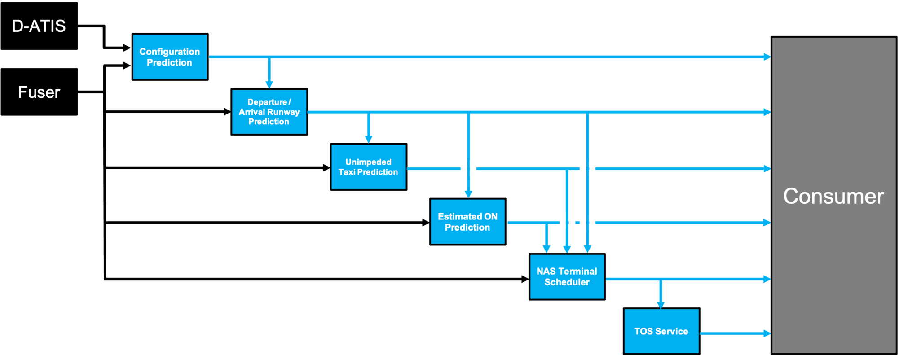

## Arrival Runway Prediction

The ML-airport-arrival-runway software is developed to provide a reference implementation to serve as a research example how to train and register Machine Learning (ML) models intended for predicting arrival runway assignments. The software is designed to point to databases which are not provided as part of the software release and thus this software is only intended to serve as an example of best practices. The software is built in python and leverages open-source libraries kedro, scikitlearn, MLFlow, and others. The software provides examples how to build three distinct pipelines for data query and save, data engineering, and data science. These pipelines enable scalable, repeatable, and maintainable development of ML models.

## ML Airport Surface Model Background Information

The ML-airport-arrival-runway model is one of several ML models tied together by the Airport Surface Model Orchestrator shown below.

 

The Airport Surface Model Orchestrator runs at fixed intervals and is driven from real-time Fused FAA System Wide Information Management (SWIM) data feeds and also pulls in additional D-ATIS airport configuration data and weather data. The data input manager within the Orchestrator prepares data for each ML service and data is exchanged between the Orchestrator and the ML services via API interfaces.

The input data sources for the individual ML prediction services are shown in the below diagram which also illustrates dependencies between the individual ML services.



The ML Airport Surface Model forms the building blocks of a cloud based predictive engine that alerts flight operators to pre-departure Trajectory Option Set (TOS) reroute opportunities within the terminal airspace. The ML Airport Surface Model was designed to be a scalable replacement for the capabilities provided by NASA's Surface Trajectory Based Operations (STBO) subsystem, which is a component of the fielded ATD2 Phase 3 System in the North Texas Metroplex. The STBO subsystem relies heavily upon detailed adaptation, which defines the physical constraints and encodes Subject Matter Expert knowledge within decision trees, and creates a costly bottleneck to scaling the pre-departure TOS digital reroute capability across the National Airspace System.

## Steps to start using this project (and some helpful information about Kedro + MLflow projects)

In addition to the steps below, take a look at the [Kedro documentation](https://kedro.readthedocs.io) and the [MLflow documentation](https://mlflow.org/docs/latest/index.html) for more help getting started.

## Set up the project conda environment

Create new environment from `conda.yml` file
```
conda env create -f conda.yaml
```
Then activate the environment.
```
conda activate arr-rwy-env
```

## Configure Kedro

*Credentials*
credentials.yml defines username, host, port to access a database which we assume has FUSER data.
A Kedro `credentials.yml` file needs to be created in `conf/local/`.
An example of such a file is in `credentials-template.yml`.

*Per-airport Globals*

In this project, each model is trained for a particular airport.
The airport and potentially airport-specific items are specified in `conf/base/globals.yml` or `conf/base/<airport_icao>_globals.yml`, where `<airport_icao>` is the ICAO identifier for an airport (e.g., KCLT).
Which particular `globals.yml` is used is specified at run time as a parameter specified in the `kedro run` command line interfaces (described below) or the airport specific file can be copied into `globals.yml`.
This approach is based on [Kedro's templated configurations capability](https://kedro.readthedocs.io/en/stable/04_kedro_project_setup/02_configuration.html#templating-configuration).
Implementing it required us to overwrite the `_create_config_loader` method in `src/arr_rwy/run.py` to use a [TemplatedConfigLoader](https://kedro.readthedocs.io/en/stable/kedro.config.TemplatedConfigLoader.html) in a way similar to what is described in the Kedro documentation, but extended to allow for the `global_config_yml` command line interface parameter.

If using Kedro's Jupyter notebook or IPython integrations, the overall `globals.yml` is always used (i.e., there is not currently any way to specify which airport-specific `<airport_icao>.globals.yml` to use when initiating the Jupyter notebook session).
The overall `globals.yml` can be updated during a Jupyter or IPython session (e.g., to specify a different airport) if, after changing the file, the `%reload_kedro` command is executed in the Jupyter notebook or IPython console session.
This will update the Kedro `context` variable to take into account the updated `globals.yml`.
See the "Working with Kedro from notebooks or IPython" section below and the [relevant Kedro documentation](https://kedro.readthedocs.io/en/stable/04_user_guide/11_ipython.html) for additional information about Kedro's Jupyter and IPython capabilities.

*Parameters*
The `conf/base/parameters.yml` file contains any parameters that control various aspects of the pipelines that engineer data and train and test models. This file can be airport-specific as well, and in that case the  ICAO identifier will prefix the file (`<airport_icao>_parameters.yml`).
The parameters file specifies, for instance, the type of maching learning model that should be used and what hyperparameters will control its training.
You may wish to update some of these parameters.
Items in `parameters.yml` that are surrounded by `${` and `}` will be imported from the `globals.yml`.
[Kedro's configuration templating documentation](https://kedro.readthedocs.io/en/stable/04_user_guide/03_configuration.html#templating-configuration) provides additional information about templated configurations via `globals.yml`.

